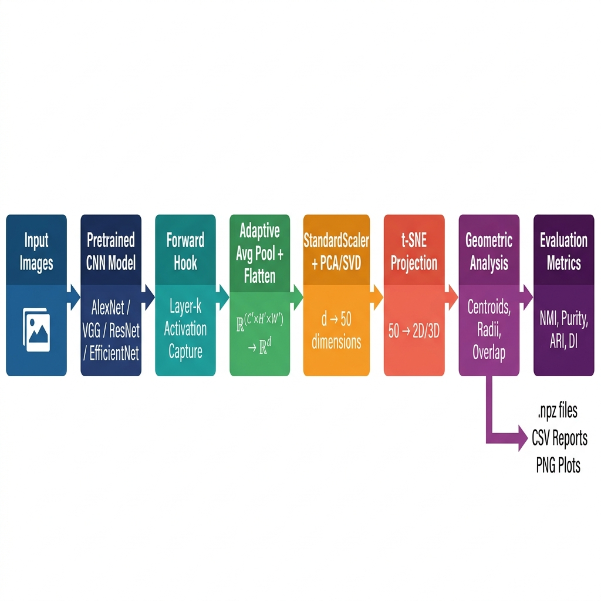
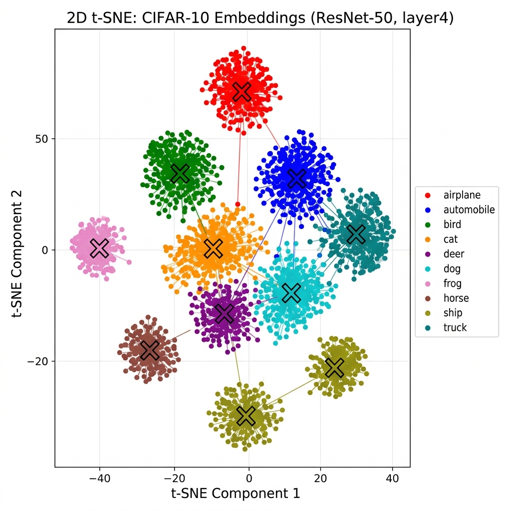
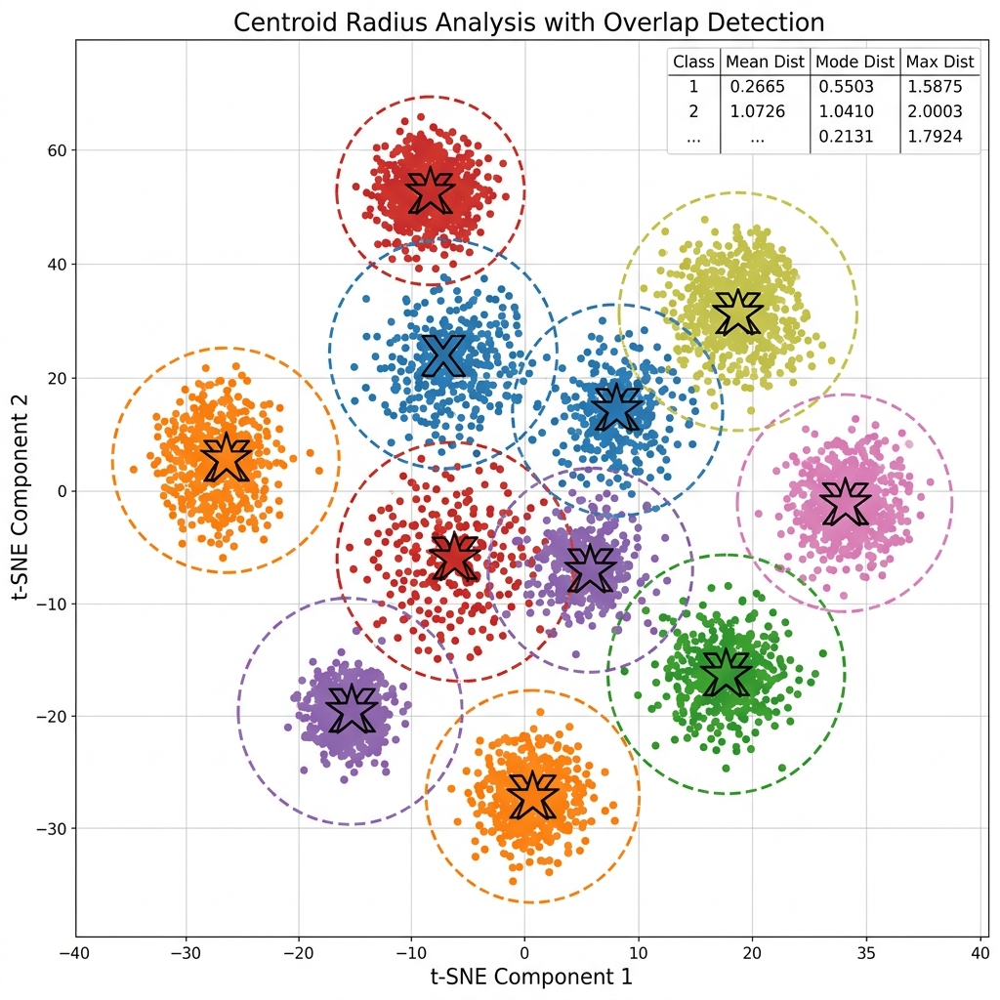

# Interactive DL Diagnostics & Embedding Analysis

[](https://www.python.org/)
[](https://pytorch.org/)
[](https://github.com/TomSchimansky/CustomTkinter)
[](LICENSE)

An interactive, application-based diagnostic framework to audit deep learning model decision-making by extracting and analyzing intermediate feature embeddings. The tool supports non-invasive hook-based feature extraction from PyTorch models, interactive dimensionality reduction, and a comprehensive suite of geometric diagnostics (including a novel **Deformity Index**).

---

## 📸 Visualization Gallery

### 1. Overall System Pipeline
The framework operates as a four-stage diagnostic pipeline. Activations are captured dynamically via forward hooks, standardized, reduced, and geometrically characterized:


### 2. Embedding Space & Overlap Audit
Visualizing the 2D t-SNE projection of dermatoscopic embeddings (HAM10000 dataset) using a ResNet-50 penultimate layer. Dashed circles denote adaptive maximum radii; crosses ($\times$) represent original centroids, and stars ($\star$) represent density-adjusted (shifted) centroids:


### 3. Geometric Centroids and Radii Concept
Illustration of the physical boundaries of class clusters in the t-SNE-projected manifold. Overlap regions correspond to areas of high inter-class confusion:


---

## 🧠 Core Methodology & Mathematical Foundations

### 1. Non-invasive Hook-based Feature Extraction
To inspect the representation layer-by-layer without altering model weights, the framework attaches PyTorch forward hooks. For convolutional outputs $\mathbf{A} \in \mathbb{R}^{C \times H \times W}$, we apply **Global Adaptive Average Pooling** to produce a translation-invariant feature vector $\mathbf{z}_i \in \mathbb{R}^C$:
$$\mathbf{z}_i = \text{flatten}(\text{AdaptiveAvgPool}_{1 \times 1}(\mathbf{A}))$$

### 2. Pairwise Centroids & Distance Metrics
For each class $c$, the *original centroid* $\mu_c$ is calculated as the arithmetic mean of all t-SNE-projected coordinates $\mathbf{u}_i$:
$$\mu_c = \frac{1}{N_c} \sum_{i: y_i = c} \mathbf{u}_i$$
The framework computes distance profiles using Euclidean, Cosine, Manhattan, and Canberra metrics.

### 3. Adaptive Maximum Radius ($R_c$)
To model tight cluster boundaries without outlier distortions, the adaptive radius $R_c$ expands as the distance to the $k$-th nearest own-class point increases, terminating when foreign-class points inside the boundary exceed own-class points:
$$R_c = \max \{r : |\{i : y_i = c, d(\mathbf{u}_i, \mu_c) \leq r\}| > |\{i : y_i \neq c, d(\mathbf{u}_i, \mu_c) \leq r\}|\}$$

### 4. Shifted (Density-Adjusted) Centroids ($\mu_c^*$)
To represent the "dense core" of a cluster while remaining robust to outliers, we compute the shifted centroid $\mu_c^*$ using only points within the adaptive boundary:
$$\mu_c^* = \frac{1}{|\mathcal{S}_c|} \sum_{i \in \mathcal{S}_c} \mathbf{u}_i, \quad \text{where } \mathcal{S}_c = \{i : y_i = c,\; d(\mathbf{u}_i, \mu_c) \leq R_c\}$$

### 5. Inter-Class Overlap Detection
Overlap between classes $c$ and $d$ is mathematically flagged when the sum of their adaptive radii exceeds the distance between their centroids:
$$d(\mu_c, \mu_d) < R_c + R_d$$

### 6. The Deformity Index (DI)
The Deformity Index (DI) is a weighted score evaluating the geometric health of a class cluster:
$$\text{DI} = 0.4 \cdot \mathcal{C} + 0.4 \cdot \mathcal{O} + 0.2 \cdot \mathcal{S}$$
* **$\mathcal{C}$ (Compactness Coefficient)**: Coefficient of variation of distances to the centroid.
* **$\mathcal{O}$ (Overlap Penalty)**: Proportion of foreign points inside the adaptive class radius.
* **$\mathcal{S}$ (Sparsity Penalty)**: Ratio of mean distance to nearest-neighbor distance.

The dataset-level Deformity Index is the average across all classes:
$$\overline{\text{DI}} = \frac{1}{C} \sum_{c=1}^{C} \text{DI}_c$$
An index $\overline{\text{DI}} < 0.25$ indicates an **Excellent** representation (compact, well-separated), whereas $\overline{\text{DI}} \geq 0.85$ signals **Very Poor** separation (nearly indistinguishable classes).

---

## 📊 Empirical Evaluation & Benchmarks

### Table I: Embedding Quality Across Datasets (ResNet-50, Penultimate Layer)
Evaluating representation geometry across clinical medical benchmarks (primary priority) and standard general-object datasets.

| Dataset | Classes | NMI $\uparrow$ | Purity $\uparrow$ | ARI $\uparrow$ | DI $\downarrow$ |
| :--- | :---: | :---: | :---: | :---: | :---: |
| **Clinical/Medical (Primary)** | | | | | |
| HAM10000 | 7 | 0.48 | 0.57 | 0.41 | 0.52 |
| PathMNIST | 9 | 0.51 | 0.60 | 0.44 | 0.48 |
| ChestMNIST | 14 | 0.42 | 0.49 | 0.33 | 0.59 |
| **General-Object Benchmarks** | | | | | |
| MNIST | 10 | 0.89 | 0.94 | 0.87 | 0.19 |
| Fashion-MNIST | 10 | 0.54 | 0.63 | 0.48 | 0.46 |
| CIFAR-10 | 10 | 0.62 | 0.71 | 0.55 | 0.41 |
| STL-10 | 10 | 0.58 | 0.66 | 0.51 | 0.38 |
| CIFAR-100 | 100 | 0.38 | 0.42 | 0.29 | 0.61 |

### Table II: Cross-Architecture Comparison (PathMNIST Dataset)
Comparing features extracted from the penultimate layers of various standard vision models.

| Architecture | Params (M) | NMI $\uparrow$ | Purity $\uparrow$ | ARI $\uparrow$ | DI $\downarrow$ |
| :--- | :---: | :---: | :---: | :---: | :---: |
| AlexNet | 61.1 | 0.34 | 0.42 | 0.25 | 0.68 |
| VGG-16 | 138.4 | 0.45 | 0.53 | 0.38 | 0.54 |
| ResNet-18 | 11.7 | 0.48 | 0.56 | 0.41 | 0.51 |
| ResNet-50 | 25.6 | 0.51 | 0.60 | 0.44 | 0.48 |
| EfficientNet-B3 | 12.2 | 0.57 | 0.66 | 0.50 | 0.42 |
| EfficientNet-V2-S | 21.5 | 0.60 | 0.69 | 0.53 | 0.39 |

### Table III: Transfer Learning Audit (HAM10000 Dataset)
A comparison showing how a pretrained backbone (ImageNet weights) forms significantly cleaner clinical geometry than a custom CNN trained from scratch.

| Metric | Pretrained ResNet-18 | Custom 4-Layer CNN |
| :--- | :---: | :---: |
| NMI $\uparrow$ | 0.46 | 0.28 |
| ARI $\uparrow$ | 0.38 | 0.16 |
| DI $\downarrow$ | 0.54 | 0.76 |
| Avg. Radius $R_c$ | 10.15 | 18.45 |
| Linear Separability | Moderate | Low |

### Table IV: Ablation Study of DI Components (HAM10000, ResNet-50)
Checking the correlation $|\rho|$ between the Deformity Index and Normalized Mutual Information when removing individual components.

| Configuration | DI $\downarrow$ | NMI $\uparrow$ | $|\rho(\text{DI}, \text{NMI})|$ |
| :--- | :---: | :---: | :---: |
| Full DI ($\alpha{=}0.4, \beta{=}0.4, \gamma{=}0.2$) | 0.52 | 0.48 | 0.93 |
| w/o Compactness ($\alpha{=}0$) | 0.47 | 0.48 | 0.85 |
| w/o Overlap ($\beta{=}0$) | 0.35 | 0.48 | 0.72 |
| w/o Sparsity ($\gamma{=}0$) | 0.58 | 0.48 | 0.89 |

### Table V: Computational Complexity of the Pipeline
Analysis of the asymptotic time and space bounds of each module in the system.

| Module | Time Complexity | Space Complexity |
| :--- | :---: | :---: |
| Feature Extraction | $\mathcal{O}(N \cdot F)$ | $\mathcal{O}(N \cdot d)$ |
| StandardScaler | $\mathcal{O}(N \cdot d)$ | $\mathcal{O}(d)$ |
| PCA (full SVD) | $\mathcal{O}(N \cdot d^2)$ | $\mathcal{O}(d^2)$ |
| t-SNE (Barnes-Hut) | $\mathcal{O}(N \log N)$ | $\mathcal{O}(N)$ |
| Centroid Computation | $\mathcal{O}(N)$ | $\mathcal{O}(C)$ |
| Radius Estimation | $\mathcal{O}(N \cdot C)$ | $\mathcal{O}(N)$ |
| K-means Clustering | $\mathcal{O}(N \cdot K \cdot I)$ | $\mathcal{O}(N \cdot d')$ |
| Deformity Index | $\mathcal{O}(N^2 / C)$ | $\mathcal{O}(N)$ |
| Inter-Centroid Heatmap | $\mathcal{O}(C^2)$ | $\mathcal{O}(C^2)$ |

---

## 🛠️ Requirements & Installation

* **Operating System**: Platform-agnostic (Windows, Linux, macOS)
* **Python**: Version 3.8 or higher
* **GPU (Optional)**: CUDA-supported GPU for CuPy-accelerated extraction

Install the required packages using pip:
```bash
pip install torch torchvision pillow numpy matplotlib seaborn scikit-learn customtkinter
```

*Note: If you have a CUDA-compatible GPU and want hardware acceleration, install the appropriate CuPy package (e.g., `pip install cupy-cuda12x` or `cupy-cuda11x`).*

---

## 🚀 Usage Guide

The diagnostic application is structured into two main scripts:

### Step 1: Extract Model Features
Launch the feature extraction interface:
```bash
python app.py
```
1. **Select Model**: Choose a built-in architecture (VGG16, ResNet18, AlexNet) or dynamically load your custom configuration (provide the `.py` definition file and `.pth` weight path).
2. **Select Layer**: Click through the parsed model architecture and select the target layer (e.g., `avgpool` or `layer4`) to attach hooks.
3. **Run Extraction**: Select your input image folder. The tool processes images, applies adaptive pooling, and serializes results as `.npy` and `.npz` feature archives under `features/`.

### Step 2: Run Embedding Visualization & Diagnostics
Launch the visualizer app:
```bash
python visualisation_app.py
```
1. **Load Data**: Open the generated `.npz` feature file.
2. **Configure Reduction**: Select the reduction method (PCA or TruncatedSVD), projection dimension (2D/3D), t-SNE perplexity, and the desired distance metric.
3. **Analyze Geometry**: Render the interactive plot. Check the dynamically generated centroid radii, class overlap stats, distance metrics, and the Deformity Index report. Pairwise inter-centroid heatmaps and tables are saved automatically.

---

## 📂 Repository Structure

```
├── app.py                     # Main Feature Extraction GUI
├── visualisation_app.py       # Embedding Visualization & Diagnostic GUI
├── custom_cnn_definition.py   # Example template for custom CNN models
├── requirements.txt           # Package dependencies list
├── figures/                   # Visual assets (pipeline, tsne, centroids)
│   ├── pipeline.png
│   ├── tsne.png
│   └── centroid.png
├── features/                  # Saved .npy and .npz extracted features
└── trained_npz/               # Combined datasets and diagnostic reports
```

---


